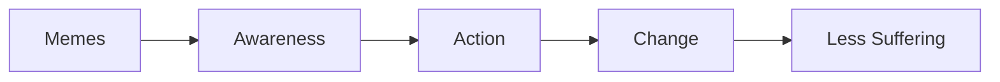

# Painkilla

---
icon: zap
---

.png)

# The Meme Coin That Hits Pain Where It Hurts

## Injecting Truth into the Crypto Circus

Pain sucks. Life is a grinder, and most of us are the sausage. While the world drowns in $100 billion worth of dog-themed meme coins, real suffering goes unaddressed. Painkilla is here to change that.

!!! warning Warning
    This isn't your typical meme coin. If you're looking for cute dogs and rocket emojis, you're in the wrong place.
!!!

## Why Painkilla?

- 🎯 **Target Real Issues**: We're tackling the grotesque, ignored, and unbearable truths of life
- 🤖 **AI-Powered Memes**: Unstoppable meme machine trained on dark truths
- ⚡ **Built on Solana**: Lightning-fast transactions, minimal fees
- 🌍 **Real Impact**: Funding initiatives that actually reduce suffering

[Explore Whitepaper](/whitepaper){ .button .primary } [Join Community](/community){ .button }

## The Revolution Starts Here

## Latest Updates

- 🚀 Presale Coming Soon
- 💪 Community Growing
- 🎯 First Pain-Fighting Initiatives Selected

[View Roadmap](/roadmap){ .button }
